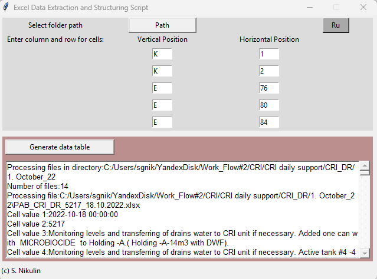

# S_4_Excel_Data_Extraction
************************************************************
NO ANY KIND OF WARRANTY

(c) S. Nikulin
************************************************************

# Excel Data Extraction and Structuring Script

A script with a graphical interface on tkinter. Used to process and extract data from files with the same structure (reports, reports).
There are 5 cells available for input, which are then saved from each file in the selected directory into a .xlsx table.

! _The table is saved in the same place where the script is located_

Two interface languages are available (Russian, English).
To select from the merged cells, select the coordinates of the upper left cell.

